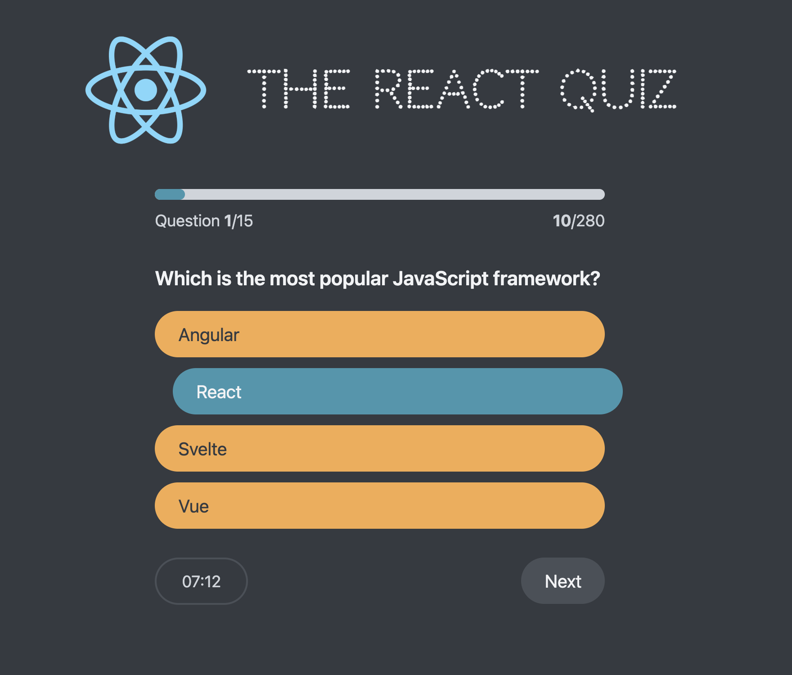

# 🧠 React Quiz App

A React quiz application that tests your knowledge of React concepts with 15 multiple-choice questions. Features a countdown timer, real-time scoring, and high score tracking.

## 📷 Preview


## ⚙️ Features 

- 15 React-focused multiple choice questions
- 30-second timer per question with visual countdown
- Real-time scoring with difficulty-based points (10-30 points)
- Progress tracking and high score persistence
- Responsive design with smooth animations
- Error handling and loading states

## 🧠 Concepts Practiced

- useReducer hook for complex state management
- Component composition and data flow
- Conditional rendering based on application state
- useEffect for side effects (data fetching, timers)
- JSON Server for mock API integration
- CSS variables and modern styling techniques

## 🚀 Getting Started

Clone the repo:

```bash
git clone https://github.com/mfa1zan/react-quiz.git
cd react-quiz
```

Install dependencies:

```bash
npm install
```

Start the JSON server (in one terminal):

```bash
npm run server
```

Start the development server (in another terminal):

```bash
npm start
```
